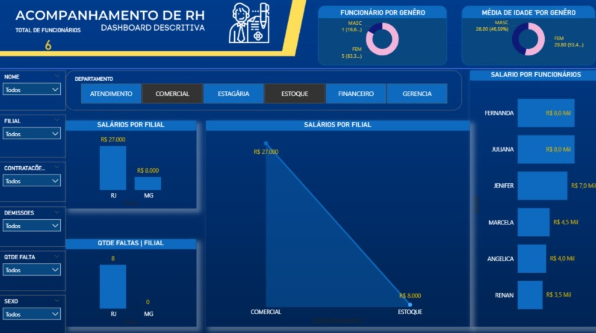
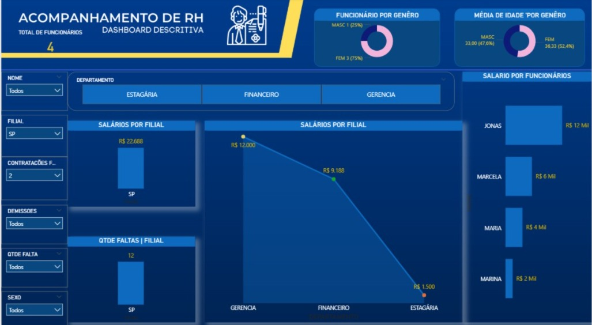
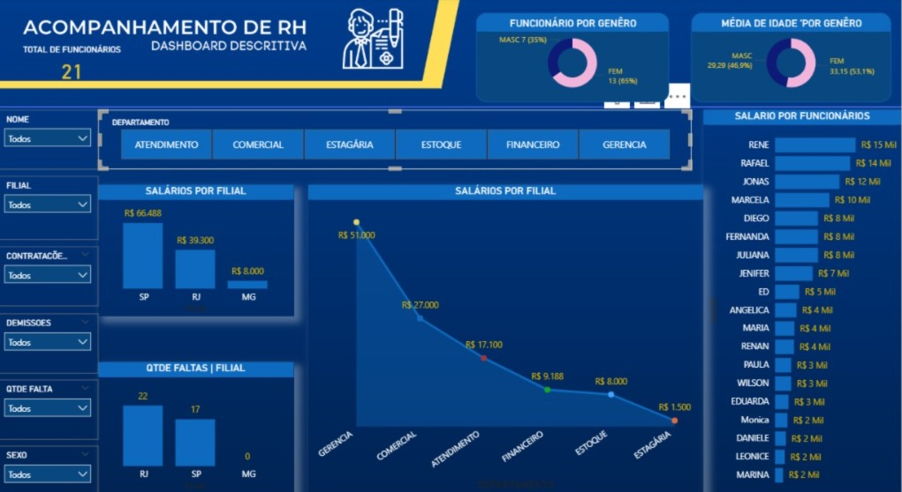

# Dashboard de RH - Análise de Colaboradores
## 🔎 Sobre o Projeto
Este projeto foi desenvolvido no Power BI com o objetivo de analisar dados de Recursos Humanos, fornecendo uma visão clara e estratégica sobre o perfil dos colaboradores, custos e indicadores organizacionais.

A proposta do dashboard é transformar dados brutos em informações relevantes para apoiar a tomada de decisão, especialmente na gestão de pessoas e controle de custos.

---

## Objetivos da Análise
- Monitorar o total de colaboradores da empresa  
- Analisar a distribuição por gênero  
- Entender o perfil etário dos funcionários  
- Avaliar custos com folha salarial  
- Identificar padrões de faltas e movimentações  

---

## KPIs Analisados

- Headcount Total (Total de funcionários)  
- Distribuição por Gênero (%)  
- Idade Média dos Colaboradores  
- Custo Total da Folha Salarial  
- Salário Médio por Funcionário  
- Custo por Departamento  
- Taxa de Absenteísmo (faltas)  
- Taxa de Turnover (contratações vs demissões)  

---

## Principais Insights

- O setor comercial e gerencial apresenta maior impacto na folha salarial  
- Existe uma distribuição relativamente equilibrada entre gêneros  
- A idade média dos colaboradores indica um time jovem/adulto (adaptar se quiser)  
- Algumas filiais concentram maior volume de faltas, indicando possível necessidade de análise operacional  
- Diferenças salariais entre departamentos mostram oportunidades de padronização ou revisão  

---

## Ferramentas Utilizadas

- Power BI  
- Modelagem de dados  
- Criação de medidas (DAX)  
- Visualização de dados  

---

## Preview do Dashboard

---

##  Base de Dados

Os dados utilizados neste projeto são fictícios/simulados, criados com fins educacionais e para prática em análise de dados.

##  Como Visualizar o Projeto

1. Baixe o arquivo .pbix disponível neste repositório  
2. Abra utilizando o Power BI Desktop  
3. Navegue pelas páginas do dashboard para explorar os dados  

[📁 Baixar arquivo Power BI](RH.pbix)
---

## Possíveis Melhorias Futuras

- Implementação de metas e comparação com resultados  
- Integração com banco de dados (SQL)  
- Criação de análises preditivas (ex: turnover futuro)  
- Publicação online via Power BI Service  

---

## Considerações Finais

Este projeto demonstra habilidades em:
- Estruturação de dashboards  
- Análise de indicadores de RH  
- Transformação de dados em insights estratégicos  

Mais do que visualização, o foco foi gerar valor através da interpretação dos dados.
